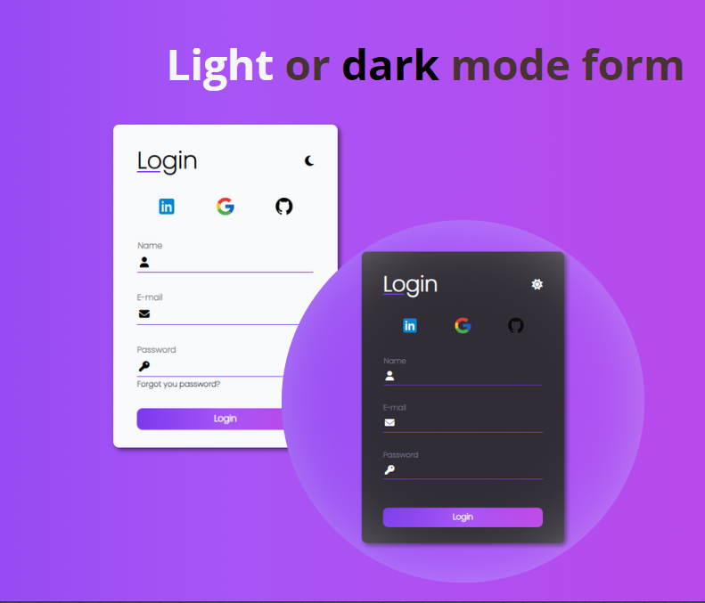

# Light or dark mode form 🧾🌞🌑
<!---->

## Sobre o projeto 💭
O formulário de modo claro ou escuro foi criado para aperfeiçoar as minhas criações de formulários, funções e condições if/else no JS. 
https://github.com/analudms/Form.git

# Como acessar o projeto? 🤔

Basta clicar [AQUI](https://analudms.github.io/Form/) que você será direcionado!

## Apresentação 👀

  

# Tecnologias utilizadas 💻
- HTML.
- CSS.
- JavaScript.

# Inspiração 💡

Projeto feito a partir de uma vídeo aula gratuita da Larissa Kich no Youtube 📺. 
https://www.youtube.com/watch?v=qKWApkuhNu8&t=203s&ab_channel=LarissaKich

# Autor 👩🏻

Ana Luiza de Melo Soares.  
https://www.linkedin.com/in/ana-luiza-melo-8b94181b3/
